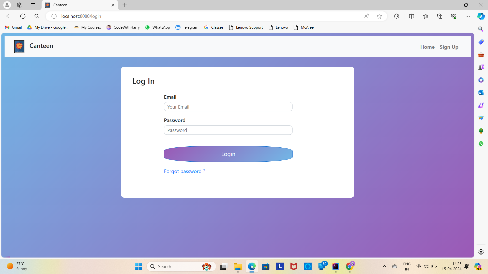
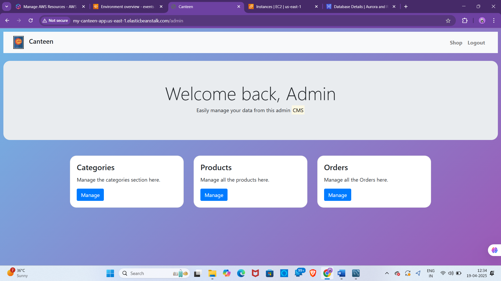
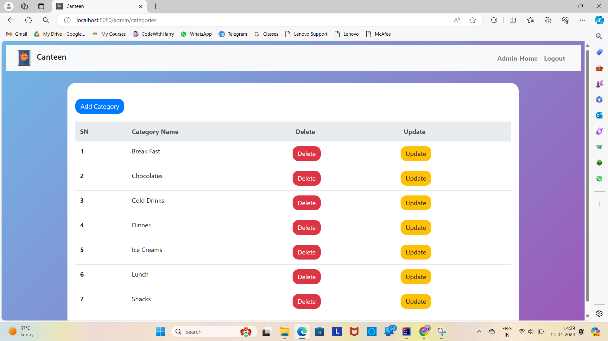
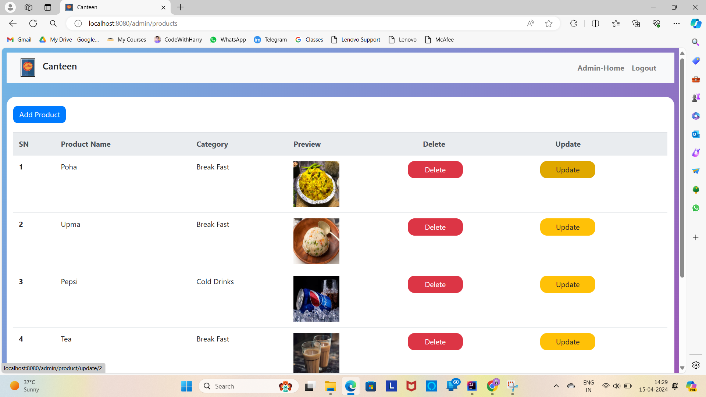
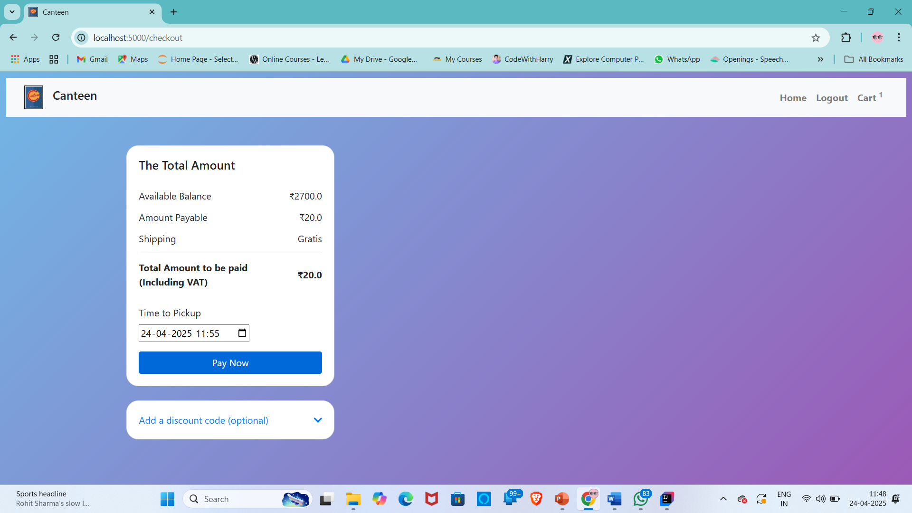
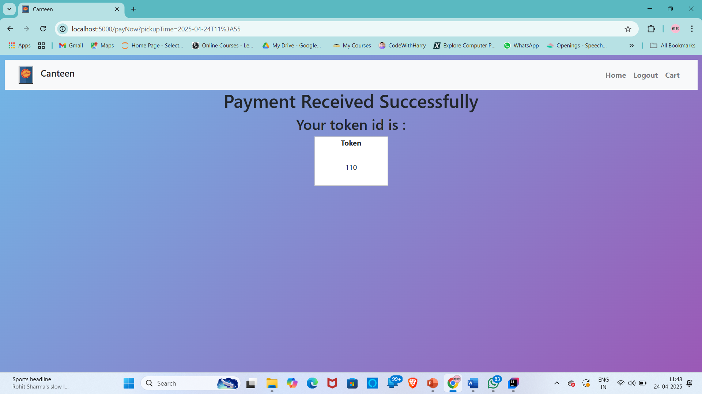
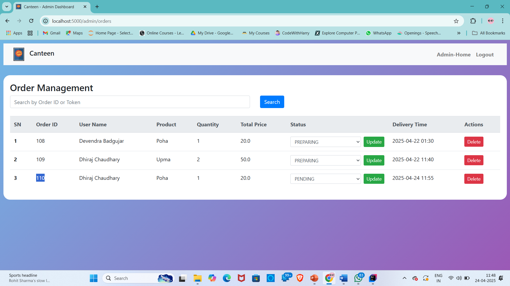

# 🍽️ Canteen Management System

A full-stack web-based application designed to streamline and digitalize canteen operations including food ordering, payment, and pickup scheduling.

## 📌 Table of Contents
- [About the Project](#-about-the-project)
- [Tech Stack](#-tech-stack)
- [Features](#-features)
- [Screenshots](#-screenshots)

---

## ✅ About the Project

The **Canteen Management System** enables users to order food online from the canteen, select a preferred pickup time, and pay digitally. Admins can manage food items, track orders, and update statuses via an interactive dashboard. It eliminates the need for physical queues, ensuring faster service and better management.

---

## 💻 Tech Stack

### Backend:
- Spring Boot (REST API)
- Spring Data JPA
- MySQL

### Frontend:
- HTML, CSS & Bootstrap
- Thymeleaf

### Tools:
- Maven
- Postman (API Testing)
- MySQL Workbench

---

## ✨ Features

### 👥 User
- Browse and filter available food items
- Add to cart and place orders
- Select pickup time
- View order status
- Receive token number after payment

### 🔐 Admin
- Admin login with role-based access
- Add/edit/delete food items and categories
- View all orders with statuses
- Update order status (e.g., Prepared, Pending)
- Delete orders

---

## 📷 Screenshots

> _Here Are Some Screenshots :_

### 🧑‍💻 User Login Page

### 🧑‍💻 Admin Home Page

### 🧑‍💻 Admin Category Page

### 🧑‍💻 Admin Product Page

### 🧑‍💻 User Pay Page

### 🧑‍💻 User Token Page

### 🧑‍💻 Admin Orders Page

